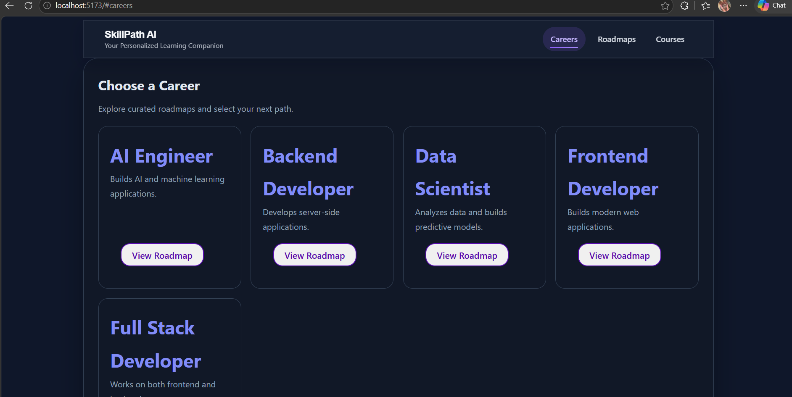
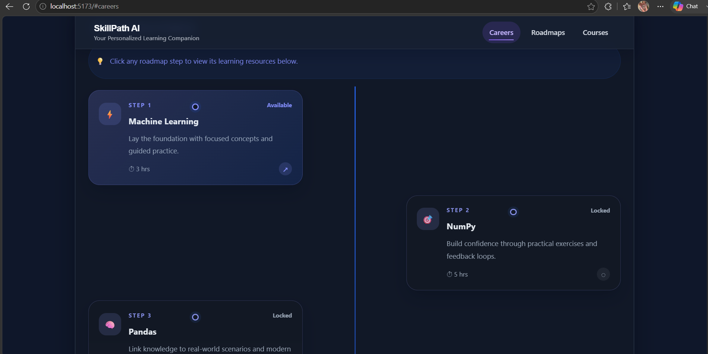
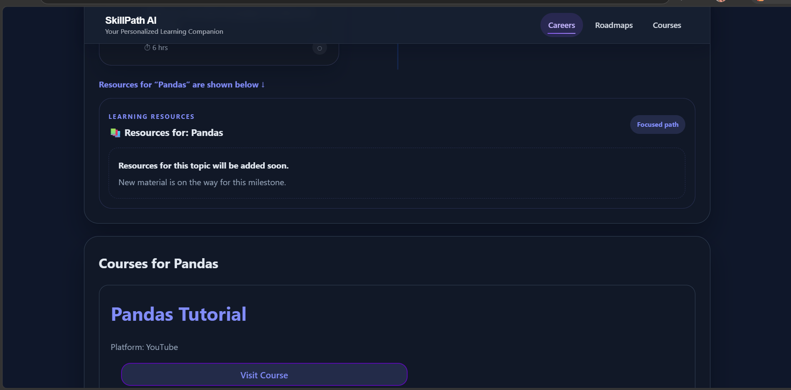
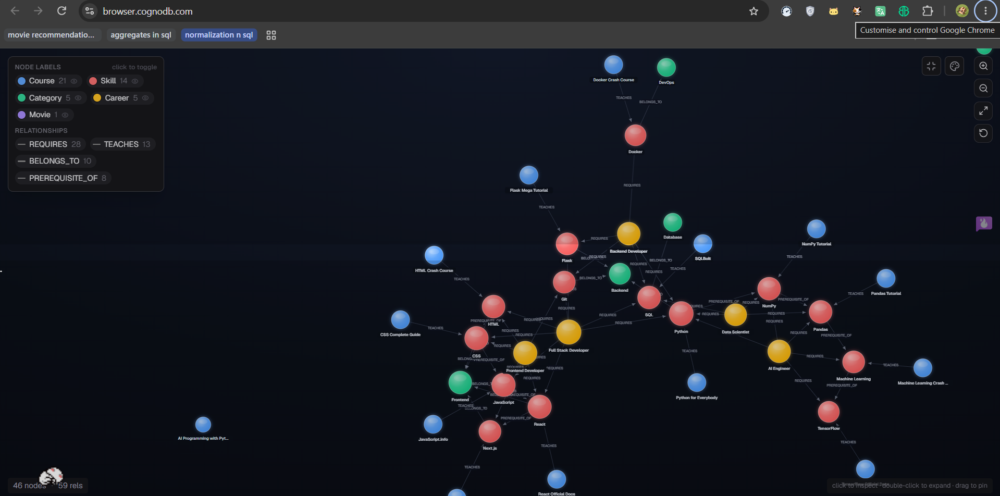

# SkillPath AI 🚀

SkillPath AI is a graph-based learning roadmap application built using **React**, **Flask**, and **CognoDB**. It helps users explore different career paths, discover the required skills, understand prerequisite relationships, and find recommended learning resources.

---

## Features

- 📌 Explore different career paths
- 📚 View skills required for each career
- 🔄 Multi-hop skill prerequisite traversal using graph queries
- 🎓 Course recommendations for each skill
- ⚡ Responsive React frontend with Bootstrap
- 🔗 Flask REST API connected to CognoDB

---

## Why a Graph Database?

This application models relationships between careers, skills, and courses.

Traditional relational databases require multiple JOIN operations and recursive queries to answer questions like:

- What skills are required for a Frontend Developer?
- What should I learn after JavaScript?
- Which courses teach React?

A graph database makes these queries simple by representing relationships directly.

Example:

```
Career
   │
 REQUIRES
   │
 Skill
  / \
 /   \
PREREQUISITE_OF   TEACHES
      │            │
    Skill        Course
```

Graph traversal makes it easy to discover connected data with efficient Cypher queries.

---

## Graph Data Model

### Nodes

- Career
- Skill
- Course

### Relationships

- `(:Career)-[:REQUIRES]->(:Skill)`
- `(:Skill)-[:PREREQUISITE_OF]->(:Skill)`
- `(:Course)-[:TEACHES]->(:Skill)`

---

## Technology Stack

### Frontend
- React
- Bootstrap
- JavaScript

### Backend
- Python
- Flask
- Flask-CORS

### Database
- CognoDB Cloud
- Neo4j Python Driver
- Cypher Query Language

---

## Project Structure

```
Skill-Learning-Roadmap-CognoDB/
│
├── backend/
│   ├── app.py
│   ├── db.py
│   ├── queries.py
│   ├── routes.py
│   ├── seed.py
│   ├── requirements.txt
│   └── .env
│
├── frontend/
│   ├── src/
│   │   ├── components/
│   │   ├── App.jsx
│   │   └── main.jsx
│   └── package.json
│
└── README.md
```

---

## Setup Instructions

### 1. Clone the Repository

```bash
git clone https://github.com/<your-username>/skillpath-ai.git
cd skillpath-ai
```

---

### 2. Create a CognoDB Instance

1. Sign up at https://console.cognodb.com
2. Create a free database instance.
3. Copy your connection URI and password.

---

### 3. Configure Environment Variables

Create a `.env` file inside the `backend` folder.

```env
DB_URI=bolt+s://your-instance-id.databases.cognodb.cloud
DB_USER=cognodb
DB_PASSWORD=your_password
```

---

### 4. Install Backend Dependencies

```bash
cd backend

pip install -r requirements.txt
```

---

### 5. Seed the Database

```bash
python seed.py
```

---

### 6. Start Backend

```bash
python app.py
```

Backend runs on

```
http://127.0.0.1:5000
```

---

### 7. Install Frontend Dependencies

```bash
cd ../frontend

npm install
```

---

### 8. Start Frontend

```bash
npm run dev
```

Frontend runs on

```
http://localhost:5173
```

---

## API Endpoints

| Method | Endpoint | Description |
|----------|-------------------------------|-------------------------------|
| GET | `/careers` | Get all careers |
| GET | `/skills` | Get all skills |
| GET | `/roadmap/<career>` | Get career roadmap |
| GET | `/courses/<skill>` | Get recommended courses |
| GET | `/prerequisites/<skill>` | Multi-hop prerequisite traversal |

---

## Sample Cypher Queries

### Get Careers

```cypher
MATCH (c:Career)
RETURN c.name, c.description
```

### Get Career Roadmap

```cypher
MATCH (c:Career {name:$career})-[:REQUIRES]->(s:Skill)
RETURN s.name
```

### Multi-hop Traversal

```cypher
MATCH (s:Skill {name:$skill})-[:PREREQUISITE_OF*]->(next:Skill)
RETURN next.name
```

### Get Courses

```cypher
MATCH (s:Skill {name:$skill})<-[:TEACHES]-(c:Course)
RETURN c.name, c.platform, c.url
```

---

## Screenshots

### Home Page



### Learning Roadmap



### Course Recommendations



### Graph Database



### Api Request


---

## Future Improvements

- User authentication
- Progress tracking
- Personalized learning plans
- Skill search
- Interactive graph visualization

---

## Author

**Ghana Shyam Gudela**

GitHub: https://github.com/Ghanashyamgudela

---

## License

This project was developed as part of the **Wexa AI CognoDB Take-Home Assignment**.
